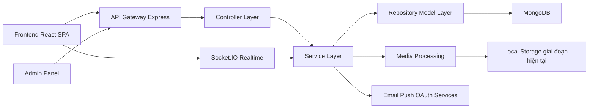
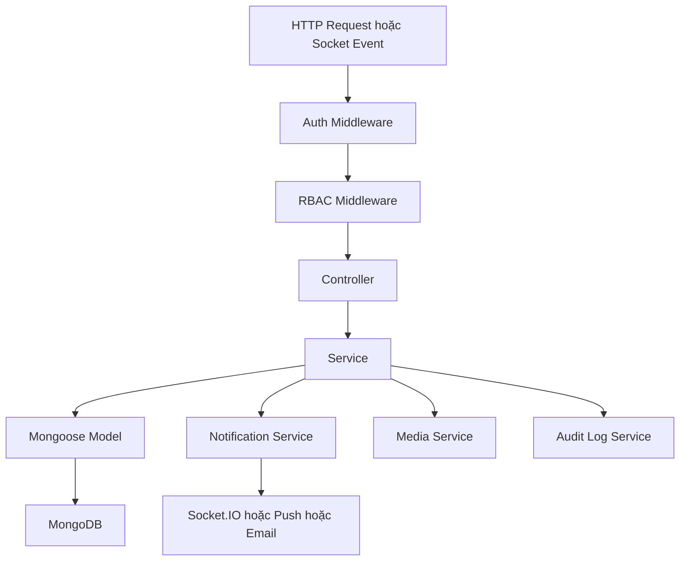
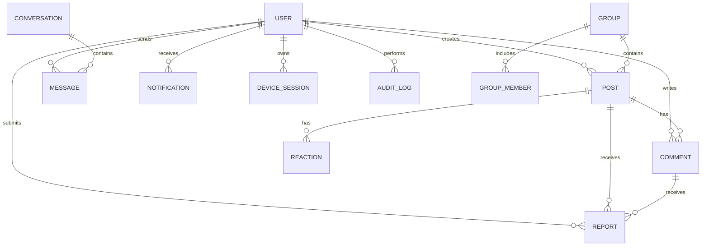

## 1. Thiết kế kiến trúc



- Kiến trúc hiện tại tiếp tục dùng mô hình client-server tách `ReactJS01` và `ExpressJS01`.
- Backend tổ chức theo `Controller -> Service -> Model`, phù hợp để mở rộng RBAC, moderation, logging và admin APIs.
- Realtime dùng `Socket.IO` cho chat, seen, typing và thông báo.
- Media xử lý qua `Multer` và `Sharp`, có thể trừu tượng hóa để nâng cấp lên cloud storage ở giai đoạn sau.

## 2. Mô tả công nghệ
- Frontend: `React 18` + `Vite` + `React Router` + `Redux Toolkit` + `Axios`
- UI hiện có: `Ant Design` + `TailwindCSS` + `styled-components`
- Backend: `Node.js` + `Express.js` + `Mongoose`
- Cơ sở dữ liệu: `MongoDB`
- Realtime: `Socket.IO`
- Upload/media: `Multer` + `Sharp`
- Xác thực: `JWT`, mở rộng `OAuth2 Google`, `OTP email`, `2FA`
- Notification: in-app notification, web push, email service
- Logging/Audit: ghi log application, audit action admin, login history theo thiết bị

## 3. Định nghĩa route
| Route | Mục đích |
|-------|---------|
| `/` | Trang chủ/feed tổng hợp |
| `/login` | Đăng nhập |
| `/register` | Đăng ký |
| `/forgot-password` | Khởi tạo quên mật khẩu |
| `/profile` | Hồ sơ cá nhân hiện tại |
| `/users/:id` | Trang cá nhân người dùng khác |
| `/search` | Tìm kiếm user/post/group/hashtag |
| `/chat` | Nhắn tin realtime |
| `/notifications` | Danh sách thông báo |
| `/groups` | Khám phá và quản lý nhóm |
| `/admin` | Dashboard admin |
| `/admin/users` | Quản lý user toàn hệ thống |
| `/admin/posts` | Quản lý bài viết và nội dung |
| `/admin/reports` | Duyệt report toàn hệ thống |
| `/admin/logs` | Audit log và cảnh báo bảo mật |

## 4. Định nghĩa API

### 4.1 Kiểu dữ liệu cốt lõi
```ts
type UserRole = "user" | "group_admin" | "moderator" | "admin" | "super_admin";
type Visibility = "public" | "friends" | "private" | "group";
type ReportTargetType = "user" | "post" | "comment" | "message" | "group";
type ReportStatus = "open" | "in_review" | "resolved" | "dismissed";
type BanType = "temporary" | "permanent";

interface AuthSession {
  accessToken: string;
  refreshToken?: string;
  expiresIn: number;
  deviceId: string;
  requires2FA?: boolean;
}

interface UserProfile {
  id: string;
  email: string;
  fullName: string;
  username: string;
  avatarUrl?: string;
  coverUrl?: string;
  bio?: string;
  role: UserRole;
  isVerified: boolean;
  followersCount: number;
  friendsCount: number;
  createdAt: string;
}

interface PostInput {
  content: string;
  visibility: Visibility;
  media?: Array<{
    type: "image" | "video";
    url: string;
    width?: number;
    height?: number;
    duration?: number;
  }>;
  mentions?: string[];
  hashtags?: string[];
  groupId?: string;
}

interface ReportRecord {
  id: string;
  targetType: ReportTargetType;
  targetId: string;
  reporterId: string;
  reason: string;
  status: ReportStatus;
  priority: "low" | "medium" | "high" | "critical";
  assignedTo?: string;
  resolutionNote?: string;
  createdAt: string;
}
```

### 4.2 API backend cốt lõi
| API | Phương thức | Mục đích |
|-----|-------------|---------|
| `/api/register` | `POST` | Đăng ký tài khoản |
| `/api/login` | `POST` | Đăng nhập và trả session JWT |
| `/api/logout` | `POST` | Đăng xuất và thu hồi phiên |
| `/api/auth/google` | `POST` | Đăng nhập Google OAuth |
| `/api/auth/verify-email` | `POST` | Xác thực email/OTP |
| `/api/auth/forgot-password` | `POST` | Gửi yêu cầu quên mật khẩu |
| `/api/auth/reset-password` | `POST` | Đặt lại mật khẩu |
| `/api/auth/change-password` | `POST` | Đổi mật khẩu |
| `/api/profile/me` | `GET` | Lấy hồ sơ hiện tại |
| `/api/profile/me` | `PATCH` | Cập nhật hồ sơ |
| `/api/profile/avatar` | `POST` | Upload avatar |
| `/api/profile/cover` | `POST` | Upload cover |
| `/api/posts` | `GET` | Lấy feed hoặc danh sách bài viết |
| `/api/posts` | `POST` | Tạo bài viết mới |
| `/api/posts/:postId` | `PATCH` | Sửa bài viết |
| `/api/posts/:postId` | `DELETE` | Xóa bài viết |
| `/api/posts/:postId/reactions` | `POST` | Thả cảm xúc |
| `/api/posts/:postId/comments` | `POST` | Bình luận bài viết |
| `/api/comments/:commentId/replies` | `POST` | Trả lời bình luận |
| `/api/social/follow/:userId` | `POST` | Follow hoặc unfollow |
| `/api/social/friend-request/:userId` | `POST` | Gửi lời mời kết bạn |
| `/api/social/block/:userId` | `POST` | Chặn người dùng |
| `/api/reports` | `POST` | Tạo report user/post/comment/message |
| `/api/search` | `GET` | Tìm kiếm tổng hợp |
| `/api/conversations` | `GET` | Lấy danh sách hội thoại |
| `/api/messages` | `POST` | Gửi tin nhắn |
| `/api/notifications` | `GET` | Lấy danh sách thông báo |
| `/api/groups` | `GET/POST` | Lấy danh sách hoặc tạo nhóm |

### 4.3 API Admin
| API | Phương thức | Mục đích |
|-----|-------------|---------|
| `/api/admin/dashboard` | `GET` | Lấy KPI tổng quan hệ thống |
| `/api/admin/users` | `GET` | Tra cứu user với filter và phân trang |
| `/api/admin/users/:userId` | `GET` | Xem chi tiết user |
| `/api/admin/users/:userId/ban` | `POST` | Ban user tạm thời hoặc vĩnh viễn |
| `/api/admin/users/:userId/unban` | `POST` | Gỡ ban |
| `/api/admin/users/:userId/status` | `PATCH` | Khóa hoặc kích hoạt lại tài khoản |
| `/api/admin/posts` | `GET` | Duyệt bài viết toàn hệ thống |
| `/api/admin/posts/:postId/remove` | `POST` | Gỡ bài viết vi phạm |
| `/api/admin/comments/:commentId/remove` | `POST` | Gỡ bình luận vi phạm |
| `/api/admin/reports` | `GET` | Lấy hàng đợi report |
| `/api/admin/reports/:reportId/assign` | `POST` | Gán admin xử lý |
| `/api/admin/reports/:reportId/resolve` | `POST` | Chốt kết quả xử lý report |
| `/api/admin/logs` | `GET` | Xem audit log và security events |
| `/api/admin/stats/content` | `GET` | Thống kê bài viết, comment, report |

## 5. Sơ đồ kiến trúc máy chủ



- `Auth Middleware` xác minh JWT, refresh token, device session và trạng thái 2FA.
- `RBAC Middleware` kiểm soát quyền `user`, `moderator`, `admin`, `super_admin`.
- `Audit Log Service` ghi nhận thao tác nhạy cảm như ban user, xóa nội dung, đổi quyền.

## 6. Mô hình dữ liệu

### 6.1 Định nghĩa mô hình dữ liệu


### 6.2 DDL định hướng
```js
// MongoDB collections
users
posts
comments
reactions
friendships
follows
blocks
conversations
messages
notifications
groups
group_events
reports
device_sessions
audit_logs
media_assets
```

- Chỉ mục đề xuất:
- `users.email`, `users.username`, `users.role`, `users.status`
- `posts.authorId + createdAt`, `posts.visibility`, `posts.hashtags`
- `reports.status + priority + createdAt`, `reports.targetType`
- `messages.conversationId + createdAt`
- `notifications.userId + createdAt + isRead`

## 7. Yêu cầu bảo mật và hiệu năng
- Dùng access token ngắn hạn kết hợp refresh token và khả năng thu hồi phiên theo thiết bị.
- Áp dụng rate limiting cho auth, comment, chat upload, search realtime và report.
- Thêm CAPTCHA cho đăng ký, đăng nhập bất thường và quên mật khẩu.
- Sanitize input, escape output, validate schema ở tất cả API để giảm XSS, injection và spam.
- Kiểm tra quyền truy cập theo visibility của post, quan hệ bạn bè, membership nhóm và block list.
- Tối ưu media bằng nén ảnh, resize nhiều kích thước, lazy loading và phân tầng lưu trữ.

## 8. Ghi chú triển khai theo codebase hiện tại
- Ưu tiên tái sử dụng cấu trúc `services`, `controllers`, `models` đang có trong `ExpressJS01`.
- Frontend `ReactJS01` cần bổ sung khu vực route admin, layout quản trị riêng và guard theo role.
- Cần làm sạch một số xung đột package/schema hiện có trước khi mở rộng chức năng quy mô lớn.
- Phần UI Admin sẽ được map chính xác theo Figma khi môi trường cung cấp MCP `figma-desktop` hoặc đầu vào thiết kế tương đương.
