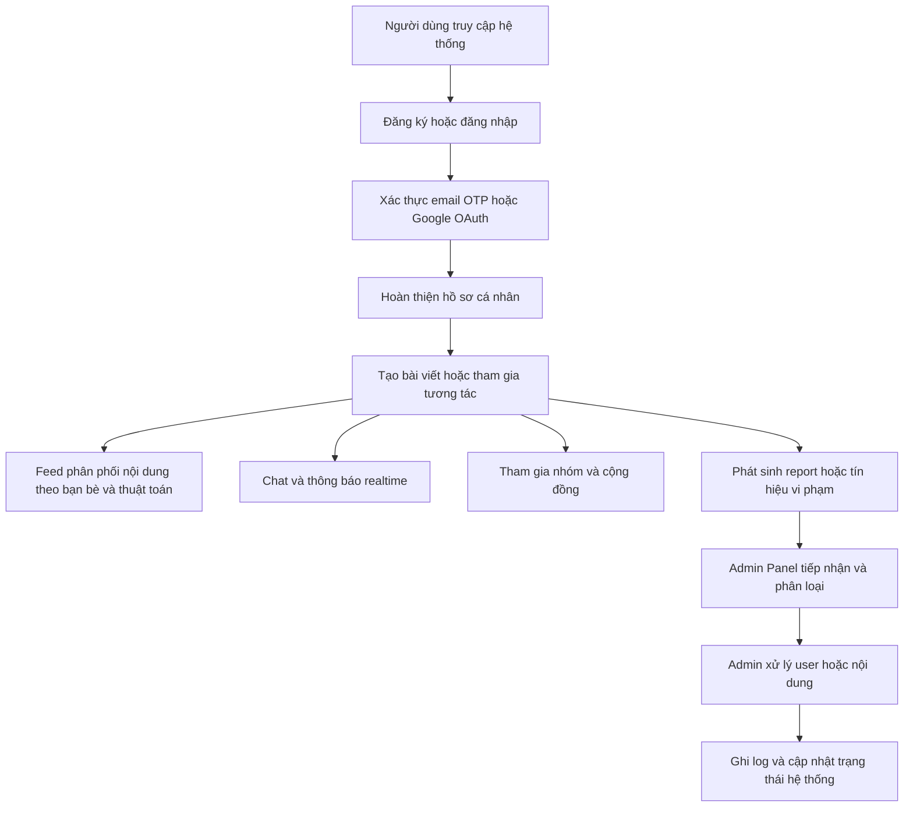

## 1. Tổng quan sản phẩm
Nền tảng mạng xã hội full-stack hỗ trợ người dùng tạo nội dung, tương tác thời gian thực, tham gia cộng đồng và được quản trị tập trung qua Admin Panel chuyên nghiệp.
- Mục tiêu là nâng cấp codebase hiện tại thành hệ thống có thể demo ở mức sản phẩm hoàn chỉnh hơn, ưu tiên bảo mật, hiệu suất, realtime và trải nghiệm quản trị nội dung.
- Đối tượng sử dụng gồm người dùng phổ thông, quản trị viên cộng đồng/nhóm và quản trị viên hệ thống.

## 2. Tính năng cốt lõi

### 2.1 Vai trò người dùng
| Vai trò | Phương thức đăng ký | Quyền hạn cốt lõi |
|------|---------------------|------------------|
| Khách | Không cần đăng ký | Xem trang công khai, truy cập đăng nhập/đăng ký |
| Người dùng | Email, Google OAuth, OTP/email verify | Tạo bài viết, chat, follow, kết bạn, tham gia nhóm, tìm kiếm |
| Quản trị nhóm | Do chủ nhóm hoặc admin hệ thống cấp | Duyệt bài nhóm, xử lý thành viên, xử lý report trong nhóm |
| Admin hệ thống | Do hệ thống cấp role | Quản lý user, bài viết, report, nội dung vi phạm, thống kê, ban tài khoản |

### 2.2 Mô-đun chức năng
1. **Xác thực và tài khoản**: đăng ký, đăng nhập, đăng xuất, quên mật khẩu, xác thực email/OTP, Google login, 2FA, lịch sử đăng nhập thiết bị.
2. **Hồ sơ cá nhân**: trang cá nhân, chỉnh sửa hồ sơ, avatar, cover, bio, album ảnh/video, bài viết ghim, danh sách bạn bè/follower.
3. **Bài viết và media**: đăng bài ảnh/video, chỉnh sửa/xóa, quyền riêng tư, chia sẻ, mention, hashtag, ghim bài.
4. **Tương tác xã hội**: like/react, comment, reply, share, follow, kết bạn, block, report.
5. **News Feed và khám phá**: feed mới nhất, feed theo bạn bè, feed đề xuất, trending topics, infinite scroll.
6. **Chat và realtime**: chat cá nhân, chat nhóm, gửi file/ảnh/video/sticker, typing, seen, thu hồi tin nhắn, audio/video call giai đoạn sau.
7. **Thông báo**: thông báo realtime, push notification, email notification, thông báo hệ thống.
8. **Tìm kiếm**: người dùng, bài viết, hashtag, nhóm, gợi ý realtime.
9. **Nhóm/Community**: tạo nhóm, xin tham gia, quyền admin/mod, bài viết trong nhóm, sự kiện nhóm.
10. **Admin Panel**: dashboard, quản lý user, quản lý bài viết, quản lý report, ban user, xử lý nội dung vi phạm, thống kê hệ thống.
11. **Bảo mật và vận hành**: JWT/Auth, OAuth2, rate limiting, CAPTCHA, chống spam, chống XSS/CSRF/injection, logging, audit trail.

### 2.3 Chi tiết trang
| Tên trang | Mô-đun | Mô tả chức năng |
|-----------|-------------|---------------------|
| Trang chủ | Feed tổng hợp | Hiển thị feed theo thuật toán, feed bạn bè, trending hashtag, composer tạo bài |
| Đăng ký/Đăng nhập | Auth | Đăng ký email, đăng nhập JWT, đăng nhập Google, xác thực OTP/email, quên mật khẩu |
| Hồ sơ cá nhân | Profile | Hiển thị thông tin người dùng, bài viết, media, follower, bạn bè, chỉnh sửa hồ sơ |
| Trang người dùng khác | Social graph | Follow, kết bạn, block, report, xem bài viết công khai |
| Tìm kiếm | Discovery | Tìm user/post/group/hashtag theo từ khóa và gợi ý realtime |
| Chat | Messaging | Danh sách hội thoại, chat cá nhân/nhóm, upload file, typing, seen, recall |
| Thông báo | Notification | Like/comment/follow/message/report update theo thời gian thực |
| Nhóm | Community | Tạo nhóm, tham gia nhóm, xem bài nhóm, quản trị thành viên, sự kiện nhóm |
| Bảng điều khiển admin | Dashboard | KPI tổng quan, tăng trưởng user/post/report, cảnh báo moderation, hành động nhanh |
| Quản lý user | Admin users | Tra cứu người dùng, khóa/mở khóa, ban, xem lịch sử thiết bị, reset bảo mật |
| Quản lý nội dung | Admin content | Duyệt/xóa bài viết, comment, media vi phạm, lịch sử xử lý |
| Quản lý report | Admin reports | Hàng đợi report, phân loại mức độ, gán xử lý, ghi nhận kết quả |
| Nhật ký hệ thống | Audit & logs | Theo dõi thao tác admin, đăng nhập bất thường, hành vi spam, lỗi hệ thống |

## 3. Luồng nghiệp vụ cốt lõi
Người dùng đăng ký hoặc đăng nhập qua email/Google, hoàn thành xác thực bảo mật, cập nhật hồ sơ và bắt đầu tạo bài viết, tương tác xã hội, chat, tham gia nhóm. Hệ thống xây dựng feed cá nhân hóa, gửi thông báo realtime và ghi nhận log bảo mật. Khi có report hoặc nội dung bất thường, Admin Panel tiếp nhận, phân loại và thực hiện moderation trên toàn hệ thống.

## 4. Thiết kế giao diện
### 4.1 Phong cách thiết kế
- Hướng thiết kế: desktop-first, chuyên nghiệp, hiện đại, thiên về social dashboard với khả năng mở rộng sang mobile.
- Màu chủ đạo: nền slate đậm hoặc trung tính, điểm nhấn xanh dương điện tử cho tương tác chính, đỏ/cam cho cảnh báo moderation.
- Nút bấm: bo tròn vừa phải, rõ trạng thái hover/focus/disabled, ưu tiên độ tương phản cao.
- Chữ: dùng cặp font sans hiện đại dễ đọc cho nội dung dài và font display tiết chế cho dashboard/admin.
- Bố cục: layout 3 cột cho feed, bảng dữ liệu cho admin, card media tối ưu preview.
- Biểu tượng: bộ icon nhất quán cho social, moderation, analytics và realtime.

### 4.2 Tổng quan thiết kế trang
| Tên trang | Mô-đun | Thành phần UI |
|-----------|-------------|-------------|
| Trang chủ | Composer + feed | Composer cố định, bộ lọc feed, card bài viết, cụm reaction/comment/share |
| Hồ sơ cá nhân | Header profile | Cover, avatar, bio, action button, tab bài viết/media/bạn bè |
| Chat | Khung nhắn tin | Sidebar hội thoại, message list, composer file/sticker, typing/seen badge |
| Tìm kiếm | Kết quả tức thì | Input sticky, tabs kết quả, highlight từ khóa, skeleton loading |
| Nhóm | Community hub | Banner nhóm, member stats, post list, moderation queue |
| Dashboard admin | KPI + bảng | Thẻ KPI, biểu đồ tăng trưởng, bảng report gần đây, bộ lọc trạng thái |
| Quản lý user | Data table | Tìm kiếm, filter trạng thái, chi tiết hồ sơ, action khóa/ban/reset |
| Quản lý report | Triage board | Danh sách report, mức độ ưu tiên, panel chi tiết, timeline xử lý |

### 4.3 Responsive
- Ưu tiên desktop-first cho Admin Panel và feed nâng cao.
- Trên tablet/mobile, chuyển layout đa cột sang drawer/tab để tối ưu thao tác chạm.
- Tối ưu lazy loading media, virtualized list, skeleton loading và giữ trải nghiệm realtime mượt.

### 4.4 Ghi chú đồng bộ Figma
- Admin Panel cần bám theo frame Figma được chọn khi có quyền truy cập MCP `figma-desktop`.
- Trong môi trường hiện tại chưa có MCP Figma khả dụng, nên tài liệu này đóng vai trò baseline chức năng và kiến trúc; phần chi tiết spacing, token màu, bảng dữ liệu và component admin sẽ được khóa theo Figma ở vòng triển khai UI.

## 5. Phạm vi triển khai đề xuất
- **Giai đoạn 1**: ổn định codebase hiện có, hoàn thiện auth, profile, post, search, notification, chat, groups.
- **Giai đoạn 2**: bổ sung bảo mật nâng cao, logging, device history, moderation workflow.
- **Giai đoạn 3**: xây Admin Panel đầy đủ với dashboard, user management, content moderation, report review.
- **Giai đoạn 4**: hoàn thiện tối ưu hiệu năng, push/email notification nâng cao, audio/video call.
